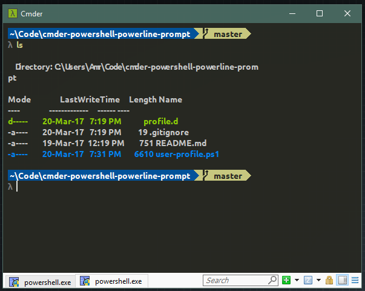

# cmder-powershell-powerline-prompt

Custom prompt (and other configurations) for PowerShell in [Cmder](http://cmder.net/).  



## Aliases
Store aliases in `profile.d` folder. To easily manage aliases, create each alias in its own file with extension `.alias.ps1`.  
To store a private alias that you don't want to include in the repo, create it with extensions `.private.alias.ps1`.  

There's a special alias for quickly jumping to favorite folders: `goToFolder.alias.ps1`.  
Favorite folders are listed in the file `goToFolder.config` under `profile.d`.  
This file is a comma-separated file that lists an alias to a folder along with its target.  
For example: `c` sends me to `~\Code`.  
To use this command, I can simply type `g c` to go to `~\Code`.  

To add additional folder aliases, simply add additional entries in the `goToFolder.config` folder.  
See `profile.d\goToFolder.config.example` for example.  

## Setting up files in Cmder config folder

It's better to store the files of this repo in its own folder so that it can be updated easily without messing up other files.  
However, user profiles files must be reside in `%CMDER%\config` folder. We can use symlinks to get around that.  

Create symlink to `user-profile.ps1`  
```powershell
new-item -path c:\bin\cmder\config\user-profile.ps1 -itemtype symboliclink -value <path to repo folder>\cmder-powershell-powerline-prompt\user-profile.ps1
```

Create symlink to `profile.d` folder  
```powershell 
new-item -path c:\bin\cmder\config\profile.d -itemtype symboliclink -value <path to repo folder>\cmder-powershell-powerline-prompt\profile.d
```